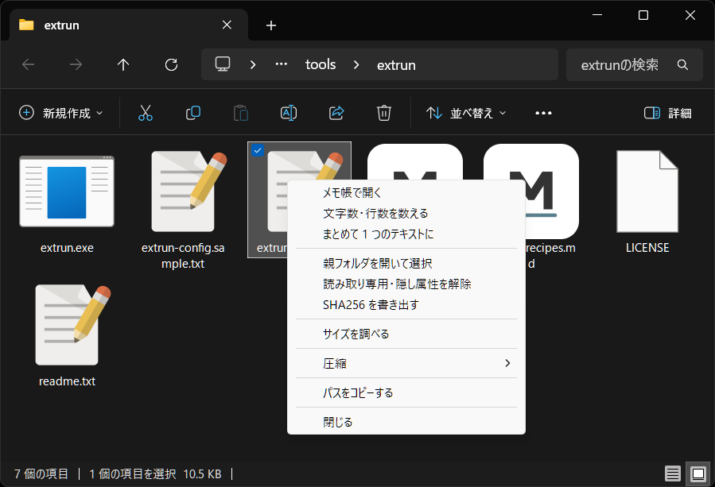

# ExtRun

**ExtRun** は、拡張子に関連付けられたコンテキストメニューから、ファイルやフォルダを任意のアプリで開く Windows 用ランチャーです。

拡張子ランチャーの名作 **ポチエス（関連付け専用版）** に強い影響を受けています。Unicode を含むパスを扱えないことが、ExtRun を作り始めたきっかけでした。

> **In English** — ExtRun is a tiny Windows launcher written in Rust. Pass it file or folder paths and it pops up a context menu at the cursor, showing only the commands that apply to those file types, then spawns the one you pick and exits. Menus are defined in a single plain-text config file (one line per entry) next to the executable. No installer, no background process, no registry writes. Documentation is in Japanese; the config file format is summarized under [設定ファイル](#設定ファイル) and specified in full in [docs/extrun-config-format.md](docs/extrun-config-format.md).



## 目次

- [特徴](#特徴)
- [インストール](#インストール)
- [使用方法](#使用方法)
- [設定ファイル](#設定ファイル)
  - [設定づくり](#設定づくり)
- [困ったときは](#困ったときは)
- [セキュリティについて](#セキュリティについて)
- [ドキュメント](#ドキュメント)
- [ライセンス](#ライセンス)

## 特徴

- **⚡ 超高速起動**: Rust 製ネイティブアプリケーション
- **🧳 インストール不要**: レジストリを書かず、常駐もしません。exe を消せばそれで終わりです
- **🎯 拡張子ベースフィルタリング**: ファイルの種類に応じて適切なアプリだけを表示
- **📁 複数ファイルの渡し方を選べる**: 選んだ数だけ同時に起動（既定）／`+` で全部を 1 つのアプリにまとめて渡す／1 つずつ順番に処理する（前のアプリを閉じると次が開く「手作業のキュー」も作れます）
- **🔧 柔軟な設定**: 1 行 1 項目のシンプルな設定ファイル。書式を覚えていなくても、同梱の**設定づくり**（`extrun-make.exe`）で入力しながら作れます
- **🖱️ マウスとキーボードの両方に配慮**: ユーザーの入力環境を問わず利用しやすい操作感

## インストール

1. リリースページから `extrun-<version>-win-x64.zip` をダウンロード
2. 任意のフォルダに展開
3. `extrun-config.sample.txt` をコピーして `extrun-config.txt` にリネーム
4. 任意で「送る」メニューに登録（[下記](#windows-エクスプローラから使う)）

同梱のサンプル設定は Windows 標準のコマンドだけで動く最小限の内容なので、追加のインストールなしでそのまま試せます。

zip には `extrun-make.exe`（[設定づくり](#設定づくり)）も入っていますが、**無くても設定は手で書けます**。

ソースからビルドする場合は `cargo build --release` です。詳しくは [docs/development.md](docs/development.md) を参照してください。

## 使用方法

```powershell
# ファイル / フォルダのパスを引数で渡すとメニューが出る
extrun.exe document.txt
extrun.exe image1.jpg image2.jpg image3.jpg
extrun.exe C:\Projects\MyProject

# 設定ファイルを検証する
extrun.exe --check

# 実際に起動されるコマンドラインを、起動せずに表示する
extrun.exe --preview image.jpg

extrun.exe --version
extrun.exe --help
```

メニューは既定でカーソル位置に出ます。`--at` / `--select-first` で呼び出しごとに変えられます（[グローバル設定](docs/extrun-config-format.md#グローバル設定)）。

### Windows エクスプローラから使う

> [!NOTE]
> AutoHotkey ユーザー向けに、便利なスクリプトを [extrun-recipes.md](docs/extrun-recipes.md#付録-c-autohotkey-から呼び出す) に付録として記載していますので、そちらも参考にして下さい。

**「送る」メニューに登録するのがおすすめです。**

1. エクスプローラのアドレスバーに `shell:sendto` と入力
2. 開いたフォルダに `extrun.exe` のショートカットを置く

右クリック →「送る」→ ExtRun で、選択中のファイルにメニューが出ます。**選んだファイルは何個でも 1 つの ExtRun にまとめて渡される**ので、`+`（まとめて渡す）を付けた項目もそのまま使えます。

ショートカットは何個でも置けます。「リンク先」の末尾にオプションを足しておけば、呼び出し方ごとにメニューの出方を変えられます。

```text
shell:sendto\
├── ExtRun.lnk           "C:\Tools\extrun\extrun.exe"
└── ExtRun (中央).lnk    "C:\Tools\extrun\extrun.exe" --at screen --select-first
```

> [!NOTE]
> **Windows 11 では「送る」は「その他のオプションを表示」の中にあります。** Shift + 右クリックで直接開けます。

#### 右クリックメニューへの直接登録は勧めません

レジストリ（`HKCU\Software\Classes\*\shell\...`）に項目を足せば、「送る」を経由せず右クリックメニューへ直接出せます。ver. 1.1.0 まではこの `.reg` を配布 zip に同梱していましたが、**Windows の仕様上の制限が大きいため取りやめました**。

ver. 1.1.0 までの `extrun-add.reg` で登録済みの場合は、同じ zip に入っていた `extrun-remove.reg` で解除できます。手元に無いときは PowerShell で次を実行してください。

```powershell
Remove-Item -LiteralPath 'HKCU:\Software\Classes\*\shell\ExtRun' -Recurse
Remove-Item -LiteralPath 'HKCU:\Software\Classes\Directory\shell\ExtRun' -Recurse
```

`-LiteralPath` が要るのは、`*` を PowerShell がワイルドカードとして解釈しないようにするためです。

## 設定ファイル

実行ファイルと同じフォルダに `extrun-config.txt`（UTF-8）を置きます。1 行 1 項目で、`名前 | パス | 引数` を `|` で区切って書きます。メニューは書かれた順に上から下へ表示されます。

```text
[.txt]

メモ帳で開く   | C:\Windows\notepad.exe
VS Code で開く | C:\Program Files\Microsoft VS Code\Code.exe | -n $p
```

`[.txt]` は「ここから下は `.txt` が対象」という見出しです。パスは絶対パスで書き、`$p` は選んだファイルのフルパスに置き換わります。

**書式の完全な仕様は [docs/extrun-config-format.md](docs/extrun-config-format.md) です。** 巻頭に記法の早見表と目次があります。

**実際のアプリでどう書くかは [docs/extrun-recipes.md](docs/extrun-recipes.md)（レシピ集）にまとめてあります。** ffmpeg・ImageMagick・IrfanView・7-Zip・VS Code・VLC・Pandoc などの設定例を、それぞれ「どの書式を使っているか」の注記付きで並べてあるので、書式の逆引きとしても使えます。外部アプリを登録するときにつまずきやすい点（コンソールが一瞬で消える、別名が引用符で終わらない、環境変数が展開されるのはパス欄だけ など）も先頭にまとめてあります。

同梱の `extrun-config.sample.txt` は、**初めて開く人がそのまま読み通せる最小限の内容**にしてあります。まず動かして、そこにお使いのアプリを書き足していくのが分かりやすいと思います。追加インストールなしで使える一歩進んだ例は、レシピ集の [3. Windows 標準コマンドだけでできること](docs/extrun-recipes.md#3-windows-標準コマンドだけでできること) にまとめてあります。

### 設定づくり

同梱の `extrun-make.exe` は、**設定ファイルに貼り付ける数行を作る**ための補助ツールです。書式を覚えていなくても、フォームに入力すれば設定ができあがります。

- 起動するアプリは「参照…」で選べる
- `$p`（選んだファイルのパス）や `$t{yyyyMMdd}`（日時）は一覧から挿し込める
- `:icon` の番号は、アイコンの一覧から選べる（imageres.dll の 369 個を数えなくてよい）
- 隣の `extrun-config.txt` を読んで、`@別名` や既にあるサブメニューを選べる
- **その設定で実際に起動されるコマンドラインが、入力するたびに出る**
- 書き方に誤りがあれば、`--check` と同じ理由がその場に出る

**設定ファイルを書き換えることはありません。** できた文字列をコピーして、ご自身で貼り付ける形です（お書きになったコメントや並びが崩れないようにするため）。**このツールを使わずに設定を書くこともできます** — 書き慣れている方はこれまでどおりテキストエディタでどうぞ。

### 書き換えたら確かめる

```powershell
extrun.exe --check                       # 書式・別名・実行ファイルのパスを検証
extrun.exe --preview "C:\photo\a.jpg"    # 起動せずにコマンドラインを表示
extrun.exe --config D:\test\my.txt ...   # 別の設定ファイルで試す（どのモードでも使えます）
```

`--check` が**書式**を見るのに対して、`--preview` は**そのパスに対して実際に何が起動されるか**を見せます。引数は 1 つ 1 行で表示されるので、`"..."` で囲み忘れて空白で割れた引数を見つけられます。

```text
形式を変換 (C) > PNG に変換
  実行ファイル  C:\Windows\System32\WindowsPowerShell\v1.0\powershell.exe
  引数　　　　  -NoProfile
  引数　　　　  -Command
  引数　　　　  Add-Type -AssemblyName System.Drawing; ...
  作業フォルダ  C:\Windows\System32\WindowsPowerShell\v1.0  （:dir 未指定のため実行ファイルの場所）
```

`--check` の終了コードは、エラーがあれば 1、警告だけ・または問題なしなら 0 です。ただし `extrun.exe` はコンソールを持たないアプリとしてビルドされているため、**PowerShell は終了を待ちません**（`$LASTEXITCODE` は設定されません）。スクリプトから判定するときは `Start-Process -Wait -PassThru` の `ExitCode` を使ってください。

## 困ったときは

| 症状 | 確認すること |
| --- | --- |
| メニューが表示されない | `extrun-config.txt` が `extrun.exe` と同じフォルダにあるか / `--check` で書式エラーが無いか / UTF-8 で保存されているか（Shift-JIS は読めません） |
| アプリが起動しない | 起動失敗の理由はダイアログに出ます。`--check` で実行ファイルのパスを確認。パスは絶対パスで。`.ps1` / `.vbs` / `.js` は直接起動できないので `powershell -File` などを経由してください（`.bat` / `.cmd` は直接書けます） |
| 選べる項目が少ない | その拡張子に対応する項目が設定に書かれていない可能性があります。**種類の違うファイルを混ぜて選んだときは、そのすべてに当てはまる項目だけが表示されます**（[仕様](docs/extrun-config-format.md#種類の違うものを混ぜて選んだとき)） |
| 書いた覚えのない確認ダイアログが出る | 一度に 20 個を超えて個別に起動するときの歯止めです（選び間違いでプロセスが大量に並ぶのを防ぎます）。数を変えるか止めるには `[extrun]` の `confirm-over`（[仕様](docs/extrun-config-format.md#件数が多いときの確認)） |
| コンソールが一瞬で消えて結果が読めない | PowerShell を挟んで `-NoExit` を付けます（[レシピ集 2-1](docs/extrun-recipes.md#2-1-黒い窓が一瞬で消えて結果が見えない)） |
| SmartScreen の警告が出る | 配布している `extrun.exe` はコード署名をしていないためです。「詳細情報」→「実行」で続行できます。zip が壊れていないかは同梱の `.sha256` と `Get-FileHash` の結果を照合して確認できます |

## セキュリティについて

ExtRun は、`extrun-config.txt` に書かれたコマンドをそのまま起動するツールです。**設定ファイルは実行可能なスクリプトと同じもの**だと考えてください。

- 出所の分からない `extrun-config.txt` をそのまま使わないでください。中身を読んでから使ってください。
- `extrun.exe` は自分と同じフォルダの設定ファイルだけを読みます。誰でも書き込めるフォルダ（`C:\` 直下など）に置くと、他のユーザーやプログラムに設定を書き換えられる可能性があります。`C:\Tools\extrun\` のような、書き込み権限が管理された場所に置いてください。
- ExtRun 自身は管理者権限を必要とせず、**レジストリの編集も、設定ファイル以外のファイル I/O も行いません。**

## ドキュメント

| ファイル名 | 内容 |
| --- | --- |
| [docs/extrun-config-format.md](docs/extrun-config-format.md) | 設定ファイル形式の完全な仕様（記法の早見表つき） |
| [docs/extrun-recipes.md](docs/extrun-recipes.md) | 設定例集。Windows 標準コマンドだけでできること・外部アプリの設定例・AutoHotkey から呼び出す例 |
| [docs/development.md](docs/development.md) | ビルド環境・プロジェクト構成・リリース手順 |
| [CHANGELOG.md](CHANGELOG.md) | 変更履歴 |

## ライセンス

MIT License — 詳細は [LICENSE](LICENSE) を参照してください。
